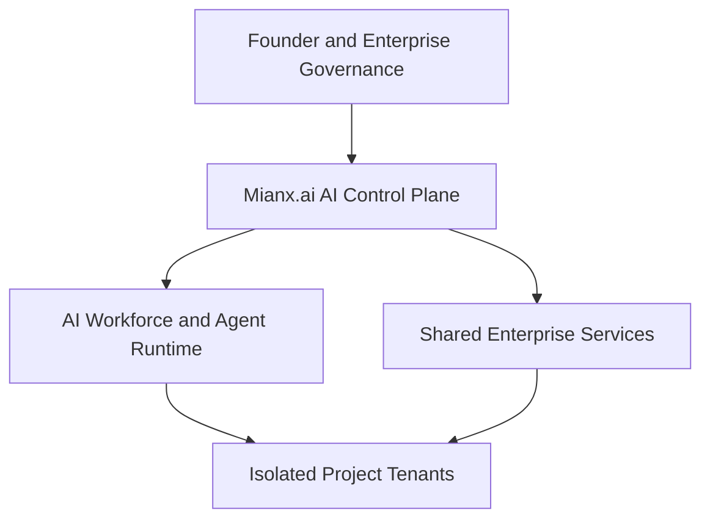

# Mianx.ai Master Blueprint

> Complete enterprise architecture specification for the Mianx.ai AI Operating System, AI Workforce, shared enterprise services, and isolated multi-project execution model.

---

## 1. Document Purpose

This blueprint defines the proposed enterprise architecture and operating model for Mianx.ai.

It establishes how Mianx.ai will:

- Operate a centralized AI workforce
- Coordinate autonomous AI agents
- Build and operate multiple enterprises
- Serve multiple client projects simultaneously
- Isolate client data and business operations
- Reuse shared platform capabilities
- Enforce governance and security
- Maintain organizational knowledge
- Route work to appropriate agents and models
- Verify every material output
- Recover safely from failures
- Scale without creating uncontrolled duplication

This document is the architectural bridge between:

```text
Founder Vision
      ↓
AI Constitution
      ↓
Enterprise Architecture
      ↓
AI Workforce Design
      ↓
Runtime Implementation
      ↓
Verification and Operations
```

---

## 2. Current Authority Status

This document currently has the following state:

```yaml
status: Draft
canonical: false
target_maturity: Production Ready
current_maturity: Documentation Baseline
```

Therefore:

- This document defines the proposed target architecture.
- It does not prove that the platform is implemented.
- It does not prove that any AI agent is active.
- It does not prove that any project is deployed.
- It does not establish regulatory certification.
- It does not authorize production launch.
- Every implementation claim requires separate evidence.
- Founder and architecture approval are required before canonical promotion.

---

## 3. Executive Summary

Mianx.ai is an Autonomous Enterprise Creation Platform designed to convert business ideas into scalable digital enterprises.

It combines six organizational identities:

1. AI Software House
2. AI Workforce Operating System
3. Autonomous Product Company
4. Research-Driven Innovation Lab
5. Enterprise Automation Company
6. Company Builder Machine

Mianx.ai will provide one governed AI Operating System that coordinates reusable AI workforce capabilities across multiple independent projects.

Each project will have:

- A separate business domain
- A separate external domain
- A separate tenant identity
- Separate users and permissions
- Separate business data
- Separate memory namespaces
- Separate secrets
- Separate budgets
- Separate workflows
- Separate deployments
- Separate observability
- Separate incident scope

Shared platform capabilities will remain centrally governed and reusable.

---

## 4. Vision

The Mianx.ai vision is:

> Build an AI-powered operating system that can design, create, operate, improve, and scale multiple digital enterprises through a governed autonomous AI workforce.

The long-term platform should enable:

- Rapid software creation
- Automated enterprise operations
- Reusable business capabilities
- Multi-project execution
- Continuous learning
- Organizational knowledge retention
- Enterprise-grade security
- Auditable decision-making
- Reliable disaster recovery
- Global client onboarding
- Industry-specific ERP creation
- Long-term maintainability

The platform should remain understandable and recoverable even ten or more years after its initial implementation.

---

## 5. Mission

Mianx.ai exists to:

- Multiply human capability through AI
- Automate repeatable enterprise work
- Reduce software-delivery time
- Reduce operational cost
- Improve product quality
- Convert market intelligence into product intelligence
- Create reusable business systems
- Build client projects concurrently
- Preserve knowledge as an organizational asset
- Operate AI agents through governed authority
- Enable safe and measurable autonomy

---

## 6. Operating Philosophy

Mianx.ai follows this organizational philosophy:

> Workforce belongs to Mianx.ai.  
> The AI OS owns execution control.  
> Projects own business outcomes.  
> Knowledge belongs to the organization under policy.  
> Templates own reusable industry expertise.  
> Shared services own reusable platform capabilities.

This produces six responsibility layers.

| Layer | Responsibility |
|---|---|
| Mianx.ai Organization | Vision, governance, ownership, investment, and enterprise policy |
| AI Workforce | Roles, skills, capabilities, performance, and organizational coordination |
| AI Operating System | Execution, routing, policy enforcement, state, and evidence |
| Shared Services | Reusable technical and business capabilities |
| Project Tenants | Business data, configurations, users, budgets, and project outcomes |
| Runtime Evidence | Proof of implementation, operation, performance, and compliance |

Documentation describes intent.

Registries describe approved configurations.

Runtime systems perform execution.

Evidence proves actual operation.

None of these SHALL be falsely represented as a replacement for another.

---

## 7. Enterprise Architecture Principles

The platform SHALL follow these principles:

### 7.1 Documentation-First

Material capabilities must be sufficiently documented before implementation.

### 7.2 API-First

Capabilities should expose governed contracts that support reuse and integration.

### 7.3 Security-by-Design

Security, privacy, and isolation must be designed into every component.

### 7.4 Automation-First

Repeatable operations should be automated when risk and control requirements permit.

### 7.5 Evidence-First Completion

No material task is complete without objective verification.

### 7.6 Tenant Isolation

Every project must remain isolated across identity, data, memory, secrets, workflows, cost, and deployment.

### 7.7 Shared Platform, Separate Business

Reusable infrastructure should be centralized while business configurations remain project-specific.

### 7.8 Loose Coupling

Components should communicate through explicit, versioned contracts.

### 7.9 Observable Systems

Every critical workflow must expose health, logs, metrics, traces, costs, and outcomes.

### 7.10 Recoverable Operations

Every critical system must define backup, rollback, restoration, failover, and incident procedures.

### 7.11 Truthful System State

The platform must distinguish planned, implemented, tested, deployed, and operational states.

### 7.12 Evolution Without Destruction

Architectures, schemas, APIs, prompts, and workflows must evolve through controlled versioning and migration.

---

## 8. High-Level System Context



The AI Control Plane governs:

- Identity
- Policy
- Authority
- Task state
- Agent selection
- Model selection
- Workflow execution
- Memory access
- Tool access
- Cost limits
- Observability
- Verification
- Escalation
- Recovery

---

## 9. Multi-Project Portfolio Baseline

The initial platform is intended to support five independent projects.

| Project ID | Project | Business Domain | External Domain | Current State |
|---|---|---|---|---|
| PRJ-001 | Telepizza Platform | Food ordering and business operations | Must be recorded in project registry | Planned integration |
| PRJ-002 | AHLT Platform | Poultry ERP and trading operations | Must be recorded in project registry | Planned integration |
| PRJ-003 | Hospital ERP | Healthcare enterprise operations | Separate domain required | Planned |
| PRJ-004 | School ERP | Education enterprise operations | Separate domain required | Planned |
| PRJ-005 | Name not yet supplied | Business domain pending | Separate domain required | Decision required |

No live DNS name SHALL be invented by documentation or AI agents.

Every project requires an approved:

- Project charter
- Legal name
- Business owner
- Product owner
- Technical owner
- Security owner
- External domain
- Tenant identifier
- Region
- Data classification
- Compliance profile
- Budget
- Architecture
- Roadmap
- Release plan
- Support model
- Exit or retirement plan

---

## 10. Control Plane and Tenant Planes

Mianx.ai uses a shared-control-plane and isolated-tenant-plane model.

### 10.1 Shared Control Plane

The shared control plane MAY provide:

- Identity federation
- Agent identity management
- Policy evaluation
- Agent routing
- Model routing
- Prompt composition
- Task orchestration
- Workflow management
- Shared observability
- Template management
- Knowledge governance
- Enterprise reporting
- Cost attribution
- Compliance evidence
- Incident coordination

### 10.2 Project Tenant Plane

Each project tenant owns:

- Project users
- Project roles
- Business configuration
- Business data
- Project APIs
- Project secrets
- Project memory
- Project knowledge
- Project workflows
- Project budget
- Project releases
- Project environments
- Project logs and dashboards
- Project incidents
- Customer-facing operations

### 10.3 Cross-Project Rule

Cross-project access is denied by default.

A cross-project operation requires:

- Explicit business purpose
- Data owner approval
- Security approval
- Legal or privacy approval where required
- Data minimization
- Defined transfer contract
- Audit logging
- Expiry
- Revocation procedure

---

## 11. Ten Core Platform Components

### 11.1 AI Operating System

Primary documentation:

```text
docs/20-ai-operating-system/
```

The AI Operating System owns:

- Execution control
- Task state
- Planning
- Scheduling
- Routing
- Agent coordination
- Policy enforcement
- Context assembly
- Workflow execution
- Error handling
- Recovery coordination
- Evidence collection

The AI OS does not independently own business data or project outcomes.

### 11.2 AI Workforce

Primary documentation:

```text
docs/19-ai-workforce/
```

The AI Workforce domain owns:

- AI organizational structure
- Departments
- Teams
- Roles
- Agent types
- Skills
- Capabilities
- Training
- Evaluation
- Certification
- Performance expectations
- Reporting hierarchy
- Escalation structure
- Agent assignment rules

A documented role does not prove an active agent.

### 11.3 Enterprise Governance

Primary documentation:

```text
docs/01-governance/
docs/30-enterprise-governance/
```

Governance owns:

- AI Constitution
- Authority
- Policies
- Risk
- Compliance
- Ethics
- Exceptions
- Decisions
- Audit requirements
- Approval models
- Accountability
- Governance reviews

### 11.4 Memory System

Primary documentation:

```text
docs/21-memory-engine/
```

The Memory System owns:

- Working memory
- Short-term memory
- Long-term memory
- Semantic memory
- Episodic memory
- Project memory
- Organization memory
- Conversation memory
- Agent memory
- Context management
- Retrieval
- Indexing
- Retention
- Deletion
- Provenance

Memory must remain project-isolated.

### 11.5 Prompt Operating System

Primary documentation:

```text
docs/20-ai-operating-system/prompt-os/
```

Prompt OS owns:

- Universal base prompt
- Hierarchy layers
- Department prompts
- Role prompts
- Project policies
- Task instructions
- Prompt inheritance
- Prompt versioning
- Prompt evaluation
- Conflict resolution
- Guardrail composition
- Tool and memory intersections

Prompt inheritance follows:

```text
Universal Base
      ↓
L0–L5 Hierarchy Layer
      ↓
Department Policy
      ↓
Role Prompt
      ↓
Project Policy
      ↓
Task Delegation
```

### 11.6 Task and Automation Engine

Primary documentation:

```text
docs/24-automation-engine/
```

The Task and Automation Engine owns:

- Task creation
- Task decomposition
- Workflow definitions
- State transitions
- Queues
- Priorities
- Scheduling
- Approvals
- Retries
- Timeouts
- Compensation
- Dead-letter handling
- Workflow recovery
- Completion evidence

### 11.7 Agent Router

Primary documentation:

```text
docs/20-ai-operating-system/router/
```

The Agent Router selects eligible agents based on:

- Project access
- Role
- Capability
- Skill
- Authority
- Tool permissions
- Memory permissions
- Model availability
- Cost
- Quality
- Workload
- Health
- Deadline
- Risk level
- Data classification

An ineligible agent SHALL NOT receive the task.

### 11.8 Model Registry and Router

Primary documentation:

```text
docs/27-model-management/
```

Model Management owns:

- Provider registry
- Model catalog
- Model metadata
- Model versions
- Model evaluation
- Capability mapping
- Model selection
- Routing rules
- Fallbacks
- Cost controls
- Usage analytics
- Fine-tuning governance
- Model deployment
- Model retirement

Restricted data SHALL NOT be sent to an unapproved provider or model.

### 11.9 Knowledge Base

Primary documentation:

```text
docs/16-knowledge/
```

The Knowledge Base owns:

- Organizational knowledge
- Project knowledge
- Taxonomies
- Ontologies
- Knowledge sources
- Content lifecycle
- Knowledge ownership
- Search
- Retrieval quality
- Knowledge review
- Knowledge archival

Knowledge and memory are related but not identical.

### 11.10 Analytics and Monitoring

Primary documentation:

```text
docs/29-observability-platform/
```

Observability owns:

- Metrics
- Logs
- Traces
- Events
- Alerts
- Dashboards
- SLOs
- Error budgets
- Agent performance
- Model performance
- Workflow performance
- Cost monitoring
- Audit evidence
- Project-level visibility

---

## 12. Supporting Enterprise Platforms

| Module | Responsibility |
|---|---|
| `22-agent-framework` | Technical agent contracts, lifecycle, identity, tools, and runtime interfaces |
| `23-multi-agent-system` | Agent coordination, scheduling, collaboration, and resilience |
| `25-intelligence-engine` | Reasoning, recommendations, synthesis, and decision support |
| `26-research-lab` | Research, experiments, evaluation, and technology transfer |
| `28-enterprise-integrations` | External connectors, contracts, events, and interoperability |
| `31-enterprise-architecture` | Capability maps, target architecture, and architectural decisions |
| `32-platform-services` | Reusable internal platform services |
| `33-marketplace` | Governed agent, plugin, template, and capability distribution |
| `34-plugin-framework` | Plugin contracts, permissions, sandboxing, and lifecycle |
| `35-sdk` | Supported integration libraries and developer tools |
| `36-cli` | Administration, automation, and diagnostics |
| `37-api-platform` | API gateway, lifecycle, security, and discovery |
| `38-developer-portal` | Developer onboarding and self-service |
| `39-deployment` | Environment promotion, release, rollback, and recovery |
| `40-enterprise-operations` | Production operations and service management |
| `41-security-platform` | Identity, security monitoring, secrets, detection, and response |
| `42-data-platform` | Governed ingestion, storage, transformation, and serving |
| `43-business-platform` | Multi-tenant ERP and reusable business capabilities |
| `44-enterprise-ai` | RAG, copilots, agentic AI, and responsible AI services |
| `45-enterprise-cloud` | Landing zones, networking, infrastructure, and cloud governance |
| `46-enterprise-quality` | End-to-end quality assurance and release gates |
| `47-enterprise-innovation` | Innovation portfolio and incubation |
| `48-enterprise-roadmap` | Strategy execution and portfolio roadmap |
| `49-enterprise-standards` | Mandatory enterprise standards |
| `50-enterprise-templates` | Reusable approved templates |

---

## 13. AI Workforce Architecture

The proposed AI workforce is organized across twenty departments.

| # | Department | Supplied Role Slots | Reports To |
|---:|---|---:|---|
| 1 | Leadership | 11 | Founder |
| 2 | Engineering | 78 | CTO |
| 3 | DevOps | 24 | CTO |
| 4 | Security | 25 | CEO |
| 5 | Infrastructure | 34 | CTO |
| 6 | Data & AI | 31 | CTO |
| 7 | Product | 11 | CEO |
| 8 | Design | 15 | CPO |
| 9 | Marketing | 19 | CEO |
| 10 | SEO | 14 | CMO |
| 11 | Sales | 20 | CEO |
| 12 | Finance | 23 | CEO |
| 13 | Human Resources | 21 | CEO |
| 14 | Legal | 25 | CEO |
| 15 | Operations | 16 | CEO |
| 16 | Support | 18 | COO |
| 17 | Customer Success | 14 | COO |
| 18 | Research | 12 | CTO |
| 19 | Quality Assurance | 18 | CTO |
| 20 | Analytics | 16 | Chief Data Officer |
|  | **Arithmetic Total** | **445** |  |

---

## 14. Workforce Count Reconciliation

The supplied planning information contains two different workforce numbers:

```text
Historical workforce statement: 258+ AI agents
Department allocation total:    445 role slots
```

These numbers SHALL NOT be treated as equivalent.

Until formally approved:

- `258+` is a historical minimum planning statement.
- `445` is the arithmetic total of the supplied department allocation.
- A role slot is not an agent instance.
- A role document is not an active agent.
- A prompt file is not an active agent.
- Worker concurrency is not organizational headcount.
- The active-agent count must come from a verified runtime registry.
- Every active count must include lifecycle state and measurement time.

Detailed reconciliation SHALL be defined in:

```text
docs/19-ai-workforce/AGENT-CAPACITY-BASELINE.md
```

---

## 15. Executive AI Leadership

The proposed executive AI registry includes:

| Agent ID | Role | Level | Primary Domain |
|---|---|---|---|
| `mianx.ceo.v1` | AI CEO | L1 | Strategy and executive coordination |
| `mianx.cto.v1` | AI CTO | L2 | Technology, architecture, engineering, and platform |
| `mianx.coo.v1` | AI COO | L2 | Operations, service delivery, and continuity |
| `mianx.cmo.v1` | AI CMO | L2 | Marketing, SEO, brand, and growth |
| `mianx.cfo.v1` | AI CFO | L2 | Finance, budgets, controls, and risk |
| `mianx.chro.v1` | AI CHRO | L2 | AI workforce lifecycle and capability |
| `mianx.cpo.v1` | AI CPO | L2 | Product strategy and outcomes |
| `mianx.cso.v1` | AI CSO | L2 | Sales and revenue operations |
| `mianx.ciso.v1` | AI CISO | L2 | Security, identity, risk, and incidents |
| `mianx.clo.v1` | AI CLO | L2 | Legal, privacy, ethics, and contracts |
| `mianx.chief-scientist.v1` | AI Chief Scientist | L2 | Research and evaluation |

All registry states remain `Proposed` until runtime activation evidence exists.

---

## 16. Agent Runtime Contract

Every active agent must have:

```yaml
identity:
  agent_id: required
  role_id: required
  role_version: required
  department: required
  hierarchy_level: required
  owner: required

governance:
  constitution_version: required
  policy_version: required
  approval_state: required
  expires_at: required

prompt:
  base_version: required
  layer_version: required
  department_version: required
  role_prompt_version: required

runtime:
  model_route: required
  fallback_route: required
  tools_allowed: required
  data_classes_allowed: required
  memory_namespaces: required
  projects_allowed: required

limits:
  financial_limit: required
  token_limit: required
  time_limit: required
  concurrency_limit: required

assurance:
  evaluation_status: required
  security_review: required
  last_evaluated_at: required
  monitoring_enabled: required
  suspension_procedure: required
```

---

## 17. Task Execution Lifecycle

Every governed task follows:

```text
Request
    ↓
Classify
    ↓
Authorize
    ↓
Plan
    ↓
Route
    ↓
Execute
    ↓
Verify
    ↓
Approve or Reject
    ↓
Record Evidence
    ↓
Learn or Close
```

Every task must capture:

- Objective
- Project
- Owner
- Constraints
- Deadline
- Data classification
- Risk
- Acceptance criteria
- Required capability
- Required tools
- Required approvals
- Failure handling
- Rollback procedure

---

## 18. Verifiable-Work Architecture

Every material task SHALL produce:

- Task identity
- Agent identity
- Project identity
- Policy version
- Prompt version
- Tools used
- Actions performed
- Artifacts created or modified
- Artifact digests
- Tests and results
- Security checks
- Quality checks
- Approvals
- Deployment evidence
- Limitations
- Residual risks
- Rollback procedure
- Final status

Permitted final statuses are:

```text
completed
partial
failed
blocked
rolled_back
```

The system SHALL NOT convert `partial`, `failed`, or `blocked` into `completed` for reporting convenience.

---

## 19. Reference Technology Baseline

The following stack is a proposed baseline and requires implementation-time validation through Architecture Decision Records.

### 19.1 Backend

- Node.js 18+ baseline
- NestJS
- TypeScript
- PostgreSQL 14+ baseline
- Redis 7+ baseline
- Prisma
- REST
- GraphQL
- OAuth 2.0
- JWT
- RabbitMQ or Kafka

Supported and secure versions must be selected before implementation.

### 19.2 Web Frontend

- React 18+ baseline
- Next.js 13+ baseline
- TypeScript
- Tailwind CSS
- Zustand
- React Query
- Custom Design System
- Jest
- React Testing Library

### 19.3 Mobile

- React Native
- TypeScript
- React Navigation
- Redux Toolkit
- Jest
- Detox

### 19.4 AI and Machine Learning

- Approved OpenAI models
- Approved Anthropic models
- Approved local models
- Approved open-source models
- Pinecone or Weaviate where justified
- Approved embedding models
- LangChain, LlamaIndex, or internal orchestration where approved
- Mianx.ai Prompt OS
- Governed RAG pipelines
- Model evaluation and routing

### 19.5 Infrastructure

- Docker
- Kubernetes
- AWS
- Azure
- GCP
- Infrastructure as Code
- GitOps
- GitHub Actions or GitLab CI
- Prometheus
- Grafana
- Centralized logging
- OpenTelemetry-compatible tracing
- Jaeger-compatible trace analysis

---

## 20. Infrastructure Capacity Baseline

### Minimum Development Baseline

```yaml
cpu: 4 cores
memory: 8 GB
storage: 100 GB
network: 100 Mbps
use_case: Local development and small non-production testing
```

### Recommended Shared Development Baseline

```yaml
cpu: 8 cores
memory: 16 GB
storage: 500 GB
network: 1 Gbps
use_case: Shared development and integration environments
```

### Production Planning Baseline

```yaml
cpu: 16+ cores
memory: 32+ GB
storage: 1 TB+
network: 10 Gbps where required
availability: High availability
use_case: Initial production-capacity planning only
```

Actual production capacity SHALL be determined through load testing, workload profiling, cost analysis, availability objectives, and project growth.

---

## 21. API Architecture Standards

| Area | Standard |
|---|---|
| Protocols | REST and GraphQL where justified |
| Format | JSON by default |
| Authentication | OAuth 2.0, JWT, and workload identity |
| Authorization | Policy-based and project-scoped |
| Versioning | Explicit versioning and compatibility policy |
| Rate limiting | Project, identity, endpoint, and risk based |
| Errors | Standard machine-readable error contract |
| Idempotency | Required for retry-sensitive write operations |
| Observability | Correlation ID, logs, metrics, and traces |
| Documentation | OpenAPI or governed GraphQL schema |
| Audit | Required for privileged and material actions |

A value such as `1000 requests per minute` is an initial planning baseline only.

---

## 22. Core Data Domains

### Identity and Access

- users
- roles
- permissions
- role_permissions
- user_roles
- sessions
- service_identities
- agent_identities
- access_policies

### AI Workforce

- agents
- departments
- teams
- role_definitions
- agent_capabilities
- agent_skills
- agent_tools
- agent_assignments
- agent_evaluations
- agent_performance
- agent_lifecycle_history

### Tasks and Workflows

- tasks
- subtasks
- workflows
- workflow_versions
- task_assignments
- task_dependencies
- task_state_history
- approvals
- execution_attempts
- work_evidence

### Knowledge and Memory

- knowledge_sources
- knowledge_documents
- knowledge_chunks
- embeddings
- vector_namespaces
- memory_records
- memory_provenance
- retention_policies
- deletion_records

### Governance

- policies
- policy_versions
- decisions
- risks
- exceptions
- compliance_records
- audit_logs
- approval_records
- constitutional_events

### Analytics and Operations

- metrics
- service_levels
- dashboards
- alerts
- incidents
- reports
- cost_records
- model_usage
- agent_usage
- project_usage

Physical schemas remain owned by the relevant architecture and data documents.

---

## 23. Security Architecture

Mianx.ai SHALL use a zero-trust security model.

Core controls include:

- Strong identity
- Least privilege
- Short-lived credentials
- Workload identity
- Tenant isolation
- Encryption in transit
- Encryption at rest
- Secret vaults
- Network segmentation
- Policy-as-code
- Secure software supply chain
- Vulnerability scanning
- Runtime monitoring
- Immutable audit evidence
- Incident containment
- Backup and restoration
- Regular access review

Security boundaries apply to:

- Human users
- AI agents
- Services
- Models
- Tools
- Plugins
- Integrations
- Databases
- Memory systems
- Cloud environments
- Deployment pipelines

---

## 24. Governance and Compliance

The platform should support controls aligned with applicable requirements, potentially including:

- GDPR
- CCPA
- PCI DSS
- ISO 27001
- SOC 2
- NIST frameworks
- OWASP guidance
- CIS controls
- Industry-specific regulation
- Customer contracts
- Regional data-protection law

Documentation SHALL distinguish:

```text
Control Designed
Control Implemented
Control Tested
Control Operating
Control Audited
Certification Achieved
```

These states are not interchangeable.

---

## 25. Observability Architecture

Every critical request should carry:

```yaml
organization_id: required
project_id: required
environment: required
correlation_id: required
task_id: required
agent_id: conditional
workflow_id: conditional
model_route: conditional
policy_version: required
```

Observability must cover:

- API latency
- Error rate
- Availability
- Queue depth
- Task completion
- Workflow failures
- Agent health
- Agent quality
- Model quality
- Model latency
- Model cost
- Token usage
- Database health
- Cache health
- Infrastructure utilization
- Security events
- Project-isolation failures
- Backup and restore status

Sensitive input and output content SHALL NOT be indiscriminately recorded in logs.

---

## 26. Reliability and Recovery

Every production-critical capability SHALL define:

- Service owner
- Service-level objectives
- Dependencies
- Failure modes
- Health checks
- Alerts
- Retry policy
- Timeout policy
- Circuit breakers
- Backup strategy
- Restore procedure
- Rollback procedure
- Failover strategy
- Incident runbook
- Recovery-time objective
- Recovery-point objective
- Continuity plan

Recovery exercises must be completed before production-readiness approval.

---

## 27. Multi-Project Concurrency Model

The platform SHALL support concurrent project execution through:

- Project-aware queues
- Project-specific rate limits
- Reserved capacity
- Priority classes
- Cost quotas
- Model quotas
- Agent concurrency limits
- Workload isolation
- Circuit breakers
- Backpressure
- Noisy-neighbour protection
- Independent deployment pipelines
- Independent rollback

Shared workers may serve multiple projects only when:

- Every request carries a verified project identity.
- The worker has explicit project authorization.
- Memory and secrets are bound after authorization.
- Project context is removed after execution.
- Logs and costs are correctly attributed.
- Cross-tenant isolation tests pass.

---

## 28. Initial Service Objectives

These are planning targets, not verified commitments.

### Agent Targets

| Metric | Initial Planning Target |
|---|---:|
| Eligible-task completion | At least 95% |
| Accepted output quality | At least 90% |
| Misleading completion reports | 0 tolerated |
| Evidence traceability | 100% for material tasks |
| Monthly measurable improvement | Greater than 5% where a baseline exists |

### System Targets

| Metric | Initial Planning Target |
|---|---:|
| Availability | 99.9% for defined production services |
| API latency | Under 200 ms for eligible endpoint classes |
| Database response | Under 50 ms for eligible query classes |
| Error rate | Under 0.1% for defined request classes |
| Concurrent users | 10,000+ after capacity validation |
| Cross-project leakage | 0 tolerated |

### Business Targets

| Metric | Initial Planning Target |
|---|---:|
| Customer satisfaction | Greater than 90% |
| Bounded product delivery | Under 30 days where scope supports it |
| Cost reduction | Greater than 50% for eligible automated processes |
| Quality improvement | Greater than 30% against approved baseline |
| Product improvements | More than five measurable improvements per month |

Every target requires a measurement definition, owner, source, window, exclusions, and review cadence.

---

## 29. AI Workforce Training Model

AI workforce readiness follows four stages.

### Stage 1 — Foundation

- AI Constitution
- Security
- Privacy
- Documentation
- Truthful reporting
- Project isolation
- Tool safety
- Verifiable work

### Stage 2 — Department

- Department responsibilities
- Domain standards
- Department workflows
- Escalation
- KPIs
- Collaboration

### Stage 3 — Role

- Role prompt
- Tools
- Memory
- Project eligibility
- Task patterns
- Evaluation scenarios
- Failure handling

### Stage 4 — Certification

- Knowledge evaluation
- Security evaluation
- Quality evaluation
- Project-isolation evaluation
- Tool-use evaluation
- Recovery evaluation
- Supervised pilot
- Approval

Training content alone does not activate an agent.

---

## 30. Twenty-Week Delivery Baseline

### Phase 1 — Foundation

```text
Weeks 1–4
```

Deliverables:

- Governance baseline
- AI Constitution
- Repository standards
- Environments
- Source repositories
- CI/CD
- Identity baseline
- Observability baseline
- AI OS kernel design
- Task-state model
- Policy engine
- Memory-isolation design
- Prompt OS foundation
- Security baseline

### Phase 2 — AI Workforce

```text
Weeks 5–12
```

Deliverables:

- Executive agent specifications
- Agent registry
- Role catalog
- Prompt hierarchy
- Engineering vertical slice
- Tool registry
- Model registry
- Agent evaluation
- Agent lifecycle
- Evidence schema
- Cost controls
- Monitoring

### Phase 3 — Project Integration

```text
Weeks 13–16
```

Deliverables:

- Telepizza tenant integration
- AHLT tenant integration
- Project-specific identity
- Project workflows
- Data contracts
- Memory namespaces
- Dashboards
- Cost attribution
- Integration testing
- Recovery exercises

### Phase 4 — Controlled Launch

```text
Weeks 17–20
```

Deliverables:

- Production environments
- Progressive deployment
- Runbooks
- Alerts
- Support process
- Incident response
- Backup and restoration
- Rollback evidence
- Client onboarding
- Feedback loop
- Launch review

---

## 31. Long-Term Roadmap

### Year 1

- AI OS foundation
- Twenty departments specified
- First governed agents activated
- Three project tenants supported
- 99.9% service objective for approved services

### Year 2

- Ten project tenants
- Improved automation coverage
- Mature cost governance
- Reduced delivery cost
- Reusable industry modules

### Year 3

- Twenty project tenants
- Agent and plugin marketplace
- Advanced enterprise intelligence
- Expanded partner ecosystem

### Years 4–5

- One hundred or more tenants where capacity supports it
- Global deployment model
- Multi-region operations
- Industry-specific autonomous enterprise templates
- Mature enterprise revenue model

---

## 32. Key Architectural Risks

| Risk | Description | Required Response |
|---|---|---|
| False readiness | Documentation is mistaken for implementation | Require runtime evidence |
| Agent-count conflict | `258+` and `445` are treated as the same value | Approve capacity baseline |
| Cross-tenant leakage | Project data or memory becomes mixed | Enforce and test isolation |
| Authority expansion | Agent exceeds delegated permissions | Policy intersection and monitoring |
| Model dependency | Platform becomes locked to one provider | Model abstraction and fallback |
| Cost explosion | Agents or models consume uncontrolled resources | Budgets, quotas, alerts, and routing |
| Prompt injection | Untrusted content changes system behaviour | Content isolation and policy enforcement |
| Knowledge poisoning | Incorrect content enters trusted knowledge | Provenance, review, and rollback |
| Silent failure | Workflow appears successful after failure | Explicit states and work envelopes |
| Unrecoverable changes | Production cannot safely roll back | Immutable releases and recovery exercises |
| Duplicate sources | Multiple folders claim canonical ownership | FRM and architecture governance |
| Regulatory exposure | Project obligations are not identified | Project compliance profile and legal review |

---

## 33. Production Readiness Gates

A capability SHALL NOT be declared production-ready until:

- [ ] Accountable owner assigned
- [ ] Architecture approved
- [ ] Security review passed
- [ ] Privacy and legal review completed
- [ ] Data classification approved
- [ ] Project boundaries tested
- [ ] Required APIs and schemas versioned
- [ ] Agent and model configurations registered
- [ ] Quality evaluations passed
- [ ] Performance testing passed
- [ ] Monitoring and alerts operational
- [ ] Budget and cost controls operational
- [ ] Backup and restoration tested
- [ ] Rollback tested
- [ ] Incident runbook exercised
- [ ] Support ownership approved
- [ ] Verifiable-Work evidence stored
- [ ] Release approval recorded

---

## 34. Blueprint Approval Requirements

| Role | Required Decision | Status |
|---|---|---|
| Founder | Vision, priorities, authority, and final approval | Pending |
| AI CEO | Enterprise operating-model approval | Pending |
| CTO | Architecture and engineering feasibility | Pending |
| COO | Operations and service-readiness review | Pending |
| CISO | Security and tenant-isolation review | Pending |
| CFO | Budget and cost-control review | Pending |
| CLO | Legal, privacy, regulatory, and ethics review | Pending |
| CPO | Product and project-portfolio review | Pending |
| Chief Scientist | AI evaluation and research review | Pending |
| Enterprise Architecture | Boundary and source-of-truth review | Pending |

---

## 35. Blueprint Promotion Checklist

Before this document becomes canonical:

- [ ] AI Constitution approved
- [ ] Workforce count conflict resolved
- [ ] Five-project portfolio approved
- [ ] Project 05 business domain supplied
- [ ] Exact external domains registered
- [ ] Component ownership approved
- [ ] Shared-service boundaries approved
- [ ] Technology choices supported by ADRs
- [ ] Security architecture approved
- [ ] Data architecture approved
- [ ] Prompt OS architecture approved
- [ ] Agent runtime contract approved
- [ ] Model governance approved
- [ ] Multi-project isolation model approved
- [ ] Reliability and recovery objectives approved
- [ ] KPIs and measurement definitions approved
- [ ] Delivery funding and owners approved
- [ ] Repository indexes updated
- [ ] Changelog updated
- [ ] Founder approval recorded
- [ ] `canonical` explicitly changed to `true`

---

## 36. Related Documents

- `docs/README.md`
- `docs/INDEX.md`
- `docs/DOCUMENT-STANDARDS.md`
- `docs/ROADMAP.md`
- `docs/01-governance/AI-CONSTITUTION.md`
- `docs/19-ai-workforce/README.md`
- `docs/20-ai-operating-system/README.md`
- `docs/21-memory-engine/README.md`
- `docs/22-agent-framework/README.md`
- `docs/23-multi-agent-system/README.md`
- `docs/24-automation-engine/README.md`
- `docs/27-model-management/README.md`
- `docs/29-observability-platform/README.md`
- `docs/30-enterprise-governance/README.md`
- `docs/31-enterprise-architecture/README.md`
- `docs/41-security-platform/README.md`
- `docs/42-data-platform/README.md`
- `docs/43-business-platform/README.md`
- `docs/48-enterprise-roadmap/README.md`
- `docs/49-enterprise-standards/README.md`

---

