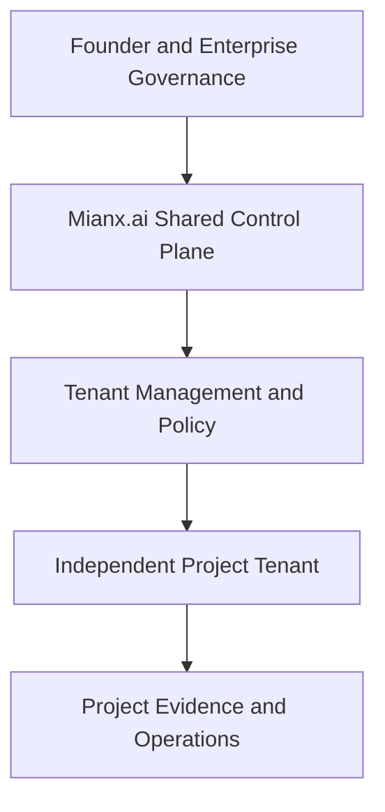

# Mianx.ai Multi-Project Operating Model

> This document defines how one governed Mianx.ai AI Operating System will safely coordinate shared AI workforce capabilities across multiple independent projects, clients, industries, and domains.

---

## 1. Document Purpose

This document establishes the operating model for running multiple projects concurrently through a centralized Mianx.ai AI Operating System.

It defines:

- Shared control-plane responsibilities
- Project tenant responsibilities
- Project identity requirements
- Domain separation
- Agent assignment
- Data isolation
- Memory isolation
- Secret isolation
- Workflow isolation
- Queue and capacity management
- Model and tool policies
- Cost attribution
- Deployment independence
- Observability
- Incident containment
- Project onboarding
- Project suspension
- Project retirement

The objective is to allow Mianx.ai to serve multiple projects simultaneously without allowing one project to compromise another.

---

## 2. Current Authority Status

This document currently has the following state:

```yaml
status: Draft
canonical: false
runtime_verified: false
tenant_isolation_verified: false
```

Therefore:

- This document describes the proposed operating model.
- It does not prove that tenant isolation is implemented.
- It does not prove that five projects are live.
- It does not establish production readiness.
- Exact external domains remain subject to project registration.
- Security and isolation tests are required before project launch.
- Founder and architecture approval are required before canonical promotion.

---

## 3. Operating Objective

Mianx.ai must operate as one enterprise platform capable of serving many projects while preserving clear business ownership and strict technical separation.

The operating objective is:

> Centralize reusable intelligence, governance, workforce, and platform services while isolating each project’s users, data, memory, credentials, workflows, budgets, deployments, and business outcomes.

The system must support:

- Multiple projects at the same time
- Separate industries
- Separate customers
- Separate legal requirements
- Separate domains
- Separate release schedules
- Separate support requirements
- Separate business data
- Separate project teams
- Shared enterprise standards
- Shared reusable technical services

---

## 4. Initial Project Portfolio

The initial operating model covers five project tenants.

| Project ID | Project Name | Business Domain | External Domain | Portfolio State |
|---|---|---|---|---|
| `PRJ-001` | Telepizza Platform | Food ordering and business operations | Must be registered | Planned integration |
| `PRJ-002` | AHLT Platform | Poultry ERP and trading operations | Must be registered | Planned integration |
| `PRJ-003` | Hospital ERP | Healthcare enterprise operations | Separate domain required | Planned |
| `PRJ-004` | School ERP | Education enterprise operations | Separate domain required | Planned |
| `PRJ-005` | Name pending | Business domain pending | Separate domain required | Founder decision required |

No AI agent SHALL invent:

- Project legal names
- Customer names
- Production domains
- Regulatory status
- Project owners
- Customer agreements
- Production-launch dates

Missing project information must be recorded as `Pending` or `Decision Required`.

---

## 5. Core Operating Principles

### 5.1 One Shared AI Operating System

Mianx.ai uses one governed AI OS to coordinate:

- Identity
- Policy
- Agents
- Models
- Tasks
- Workflows
- Memory access
- Tools
- Observability
- Evidence
- Cost controls
- Escalation

### 5.2 Separate Project Tenants

Every project operates inside a separately identifiable tenant boundary.

### 5.3 Deny Cross-Project Access by Default

An identity authorized for one project receives no automatic access to another project.

### 5.4 Shared Capabilities, Isolated Business State

Reusable platform services may be shared.

Project business state must remain isolated.

### 5.5 Project-Aware Execution

Every task, event, API request, workflow, log, cost, memory record, and artifact must carry a verified project context.

### 5.6 Independent Release and Recovery

One project must be deployable, suspended, rolled back, or restored without requiring another project to change state.

### 5.7 Evidence-Based Status

Project status must be determined through verified evidence rather than unsupported reports.

---

## 6. High-Level Architecture



The architecture separates:

```text
Shared Governance and Control
             ↓
Project-Aware Authorization
             ↓
Isolated Tenant Execution
             ↓
Project-Specific Evidence
```

---

## 7. Shared Control Plane

The shared control plane MAY own:

- Enterprise identity federation
- Agent identity registry
- Project registry
- Policy evaluation
- Agent routing
- Model routing
- Prompt composition
- Task orchestration
- Workflow orchestration
- Shared template catalog
- Shared service catalog
- Enterprise observability
- Cost attribution
- Compliance evidence
- Security monitoring
- Incident coordination
- Platform configuration
- Shared knowledge governance

The control plane SHALL NOT automatically own:

- Project business data
- Project-specific credentials
- Project customer records
- Project-specific financial records
- Project release decisions
- Project legal commitments
- Project-specific memory content

---

## 8. Project Tenant Plane

Each project tenant owns:

- Project identity
- Project users
- Project roles
- Project agent assignments
- Business rules
- Business workflows
- Business data
- Project memory
- Project knowledge
- Project secrets
- Project files
- Project integrations
- Project budgets
- Project environments
- Project release schedule
- Project observability views
- Project incidents
- Project backup policy
- Project recovery procedure
- Project support process

A project owner remains accountable for project business outcomes.

---

## 9. Project Registry

Every project SHALL have a registered project record.

```yaml
project:
  project_id: required
  tenant_id: required
  project_name: required
  legal_name: conditional
  business_domain: required
  external_domain: required_before_launch
  portfolio_state: required
  data_classification: required
  compliance_profile: required
  primary_region: required
  backup_region: conditional

ownership:
  business_owner: required
  product_owner: required
  technical_owner: required
  security_owner: required
  data_owner: required
  operations_owner: required
  financial_owner: required

configuration:
  identity_policy: required
  data_policy: required
  memory_policy: required
  model_policy: required
  tool_policy: required
  workflow_policy: required
  deployment_policy: required
  retention_policy: required
  budget_policy: required

lifecycle:
  created_at: required
  approved_at: conditional
  launched_at: conditional
  suspended_at: conditional
  retired_at: conditional
  review_at: required
```

A project SHALL NOT enter production without a complete and approved registry record.

---

## 10. Project Lifecycle

Each project follows:

```text
Proposed
    ↓
Discovery
    ↓
Architecture
    ↓
Approved
    ↓
Build
    ↓
Integration
    ↓
Pilot
    ↓
Production
    ↓
Scale
    ↓
Suspended or Retired
```

### 10.1 Proposed

The business idea and initial owner are identified.

### 10.2 Discovery

The project defines:

- Users
- Problem
- Business value
- Industry
- Scope
- Risks
- Data
- Compliance requirements

### 10.3 Architecture

The project defines:

- Tenant model
- System architecture
- Security
- Data architecture
- Integrations
- Deployment
- Recovery
- Cost model

### 10.4 Approved

Required owners and reviewers authorize implementation.

### 10.5 Build

Product and platform capabilities are implemented.

### 10.6 Integration

Project services connect to approved shared and external systems.

### 10.7 Pilot

A limited tenant or user group validates the project.

### 10.8 Production

The project passes launch gates and begins controlled production operation.

### 10.9 Scale

Capacity and functionality expand based on verified demand.

### 10.10 Suspended or Retired

Execution stops through a governed process while data and evidence receive approved treatment.

---

## 11. Mandatory Request Context

Every project request SHALL carry:

```yaml
request_context:
  organization_id: required
  project_id: required
  tenant_id: required
  environment: required
  actor_id: required
  actor_type: required
  correlation_id: required
  policy_version: required
  data_classification: required
  request_time: required
```

Conditional fields include:

```yaml
conditional_context:
  task_id: conditional
  workflow_id: conditional
  agent_id: conditional
  model_route: conditional
  change_id: conditional
  release_id: conditional
  incident_id: conditional
```

A request missing required tenant context SHALL be rejected.

---

## 12. Domain and DNS Isolation

Every production project SHALL use a separately registered external domain or approved subdomain structure.

A domain record SHALL identify:

- Domain name
- Legal owner
- Registrar
- DNS provider
- Technical owner
- Security owner
- Certificate owner
- Renewal date
- Project ID
- Environment
- Approved endpoints
- Incident contact

Environment separation SHOULD follow a controlled model such as:

```text
Project Production Domain
Project Staging Domain
Project Development Domain
Project API Domain
Project Admin Domain
```

Exact domains must be recorded in the project registry.

Documentation SHALL NOT invent live domains.

---

## 13. Identity and Access Isolation

Every identity SHALL be scoped by:

- Organization
- Project
- Environment
- Role
- Permission
- Data class
- Time
- Risk
- Authentication strength

Identity types include:

- Human users
- AI agents
- Services
- Workloads
- Integrations
- Emergency identities

An identity with access to `PRJ-001` SHALL NOT automatically receive access to `PRJ-002`.

Authorization must evaluate:

```text
Who is requesting?
Which project?
Which environment?
Which resource?
Which action?
Which data classification?
Which policy version?
Which delegation?
Which risk class?
```

---

## 14. Agent Assignment Isolation

An AI agent may serve a project only when the Agent Registry confirms:

```yaml
agent_assignment:
  agent_id: required
  organization_id: required
  project_id: required
  role_id: required
  assignment_type: dedicated | shared | temporary
  tools_allowed: required
  data_classes_allowed: required
  memory_namespaces: required
  financial_limit: required
  effective_from: required
  expires_at: required
  approved_by: required
```

Agent assignments SHALL be:

- Explicit
- Time-bounded
- Project-scoped
- Revocable
- Auditable
- Supported by evaluation

A shared agent SHALL clear or isolate project-specific execution context before serving another project.

---

## 15. Data Isolation

Project data must be isolated through controls appropriate to risk.

Possible isolation patterns include:

- Separate databases
- Separate schemas
- Separate cloud accounts
- Separate storage buckets
- Separate encryption keys
- Separate search indexes
- Separate data warehouses
- Separate lakehouse zones
- Row-level project security

The selected pattern must be documented through an Architecture Decision Record.

Every data record SHOULD identify:

```yaml
organization_id: required
project_id: required
tenant_id: required
classification: required
owner: required
retention_class: required
```

Cross-project queries are denied unless explicitly approved.

---

## 16. Memory and RAG Isolation

Every project SHALL have separate:

- Memory namespace
- Vector namespace
- Retrieval filters
- Knowledge source catalog
- Embedding ownership
- Retention policy
- Deletion policy
- Access policy
- Evaluation results

A project RAG request must filter by:

```yaml
memory_scope:
  organization_id: required
  project_id: required
  tenant_id: required
  environment: required
  data_classification: required
  access_policy: required
```

Shared organizational knowledge may be retrieved only when:

- It is approved for reuse.
- It does not contain restricted project data.
- The requesting agent has access.
- Provenance remains available.
- Retrieval is logged.

---

## 17. Secret Isolation

Every project SHALL have a separate secret namespace.

Secrets include:

- API keys
- Database credentials
- OAuth credentials
- Private keys
- Certificates
- Webhook secrets
- Provider tokens
- Deployment credentials

Secrets SHALL:

- Remain outside documentation
- Remain outside prompts
- Remain outside source control
- Use short-lived access where possible
- Use workload identity where possible
- Be rotated
- Be access logged
- Be project scoped
- Be environment scoped

One project’s secret SHALL NOT be copied into another project’s namespace.

---

## 18. Network Isolation

Project network architecture SHOULD define:

- Ingress boundaries
- Egress boundaries
- Private networks
- Public endpoints
- Service-to-service authentication
- Firewall rules
- Network policies
- DNS rules
- API gateway policies
- Integration allowlists
- Monitoring
- Incident containment

Cross-project network communication must be denied by default.

Shared services must authenticate and authorize every tenant request.

---

## 19. Workflow Isolation

Every workflow SHALL identify:

```yaml
workflow:
  workflow_id: required
  workflow_version: required
  project_id: required
  tenant_id: required
  environment: required
  policy_version: required
  owner: required
```

Workflow state SHALL remain project-scoped.

Project workflows SHALL have separate:

- State records
- Approval records
- Retry history
- Dead-letter records
- Evidence
- Audit history
- Recovery checkpoints

A failed workflow in one project SHALL NOT corrupt another project’s workflow state.

---

## 20. Queue and Event Isolation

Tasks and events SHALL carry:

- Project ID
- Tenant ID
- Event type
- Schema version
- Correlation ID
- Producer identity
- Timestamp
- Classification
- Idempotency key

Queue isolation MAY use:

- Separate queues
- Separate topics
- Separate partitions
- Project-aware routing keys
- Enforced project attributes

Consumers SHALL validate project authorization before processing a message.

Unknown or invalid project messages must be rejected or quarantined.

---

## 21. Model-Route Isolation

Each project SHALL have an approved model policy.

```yaml
model_policy:
  project_id: required
  approved_providers: required
  approved_models: required
  approved_regions: required
  allowed_data_classes: required
  prohibited_use_cases: required
  fallback_routes: required
  token_limits: required
  cost_limits: required
  retention_requirements: required
```

Restricted project data SHALL NOT be sent to:

- Unapproved providers
- Unapproved models
- Unapproved regions
- Consumer accounts
- Uncontrolled endpoints
- Providers with incompatible retention policies

---

## 22. Tool and Plugin Isolation

Every project SHALL define an approved tool policy.

Tool authorization must identify:

- Agent
- Project
- Environment
- Tool
- Action
- Resource
- Data class
- Financial limit
- Expiry
- Approver

Plugins SHALL be:

- Registered
- Versioned
- Permission-scoped
- Security-reviewed
- Project-approved
- Observable
- Revocable

A project plugin SHALL NOT access another project unless an explicit approved contract exists.

---

## 23. Shared Service Model

A service may become shared only when it has:

- Accountable enterprise owner
- Stable API or event contract
- Tenant-aware authorization
- Project-isolation tests
- Versioning policy
- Availability objective
- Capacity model
- Cost-allocation model
- Security review
- Support model
- Recovery model
- Deprecation policy

Possible shared services include:

- Identity
- Notifications
- File scanning
- Audit logging
- Model routing
- Agent routing
- Workflow orchestration
- Observability
- Feature flags
- Template catalog
- Knowledge governance

Shared does not mean unrestricted.

---

## 24. Project-Specific Service Model

A project-specific service:

- Implements project business logic
- Uses project data
- Uses project policies
- Is deployed independently
- Is monitored independently
- Is budgeted to the project
- Has a project owner
- Has a project recovery procedure

A project-specific service may later become shared only through architecture review and controlled extraction.

---

## 25. Environment Isolation

Each project SHOULD maintain:

```text
Local Development
      ↓
Shared Development
      ↓
Integration
      ↓
Testing
      ↓
Staging
      ↓
Production
```

Environment promotion SHALL require:

- Approved artifact
- Version identity
- Test evidence
- Security evidence
- Configuration validation
- Secret validation
- Deployment approval
- Rollback procedure

Development identities SHALL NOT automatically access production.

---

## 26. Deployment Independence

Each project SHALL have an independent deployment pipeline.

A project deployment SHALL identify:

- Project ID
- Environment
- Artifact version
- Commit ID
- Configuration version
- Database migration
- Approver
- Deployment time
- Health checks
- Rollback point
- Evidence envelope

Deployment of one project SHALL NOT automatically deploy another project.

Shared-control-plane changes require compatibility testing across affected projects.

---

## 27. Cost and Budget Isolation

Every cost must be attributable through:

```text
Organization
    ↓
Project
    ↓
Environment
    ↓
Department
    ↓
Agent or Service
    ↓
Workflow
    ↓
Task
```

Project budgets SHOULD include:

- Model usage
- Embeddings
- Vector storage
- Compute
- Databases
- Object storage
- Network
- External APIs
- Observability
- Backups
- Security
- Support
- Agent execution

Each project SHALL define:

```yaml
budget:
  monthly_limit: required
  daily_limit: required
  alert_thresholds: required
  model_limit: required
  workflow_limit: required
  emergency_override: required
  financial_owner: required
```

One project SHALL NOT silently consume another project’s budget.

---

## 28. Capacity and Fair Scheduling

Shared resources SHALL use fair and project-aware scheduling.

Capacity controls include:

- Project quotas
- Reserved capacity
- Priority queues
- Rate limits
- Token limits
- Agent concurrency
- Model concurrency
- Circuit breakers
- Backpressure
- Workload shedding
- Emergency capacity

Priority classes are:

| Priority | Use |
|---|---|
| P0 | Critical security or availability emergency |
| P1 | Critical production or customer failure |
| P2 | High-priority release or business deadline |
| P3 | Normal planned work |
| P4 | Background research and optimization |

Priority elevation requires a reason and audit record.

---

## 29. Observability Isolation

Every log, metric, event, and trace SHOULD identify:

```yaml
organization_id: required
project_id: required
tenant_id: required
environment: required
correlation_id: required
service_id: required
agent_id: conditional
workflow_id: conditional
```

Project owners should see authorized project telemetry.

Enterprise operators may access aggregated cross-project telemetry only under approved policy.

Sensitive project content SHALL NOT be included in unrestricted logs.

---

## 30. Project-Level Service Objectives

Every project SHALL define:

- Availability objective
- Latency objective
- Error-rate objective
- Recovery-time objective
- Recovery-point objective
- Queue-time objective
- Support-response objective
- Data-freshness objective
- Cost objective
- Security-response objective

Shared platform SLOs do not automatically replace project-specific business SLOs.

---

## 31. Cross-Project Data Sharing

Cross-project data sharing is denied by default.

An approved transfer SHALL define:

```yaml
data_transfer:
  transfer_id: required
  source_project: required
  destination_project: required
  business_purpose: required
  data_owner: required
  data_categories: required
  minimization: required
  legal_basis: required
  security_review: required
  approved_by: required
  effective_from: required
  expires_at: required
  audit_reference: required
```

Where possible, use:

- Aggregated data
- Anonymized data
- Pseudonymized data
- Approved shared knowledge
- Metadata rather than raw content

---

## 32. Cross-Project Workflow

A cross-project workflow requires:

- Shared business purpose
- All affected project owners
- Approved data contracts
- Security review
- Legal and privacy review where applicable
- Separate project states
- Failure containment
- Independent rollback
- Cost allocation
- Evidence for every project

Failure in one project must not leave another project in an untraceable state.

---

## 33. Project Onboarding

A new project onboarding process SHALL include:

1. Project charter
2. Project registry record
3. Ownership assignment
4. Business-domain definition
5. External-domain registration
6. Data classification
7. Compliance profile
8. Tenant creation
9. Identity configuration
10. Secret namespace
11. Data architecture
12. Memory namespace
13. Model policy
14. Tool policy
15. Agent assignments
16. Budget policy
17. Deployment environments
18. Observability
19. Backup and recovery
20. Security testing
21. Project-isolation testing
22. Pilot approval
23. Production approval

No project should bypass onboarding because it is urgent.

---

## 34. Project Suspension

A project may be suspended because of:

- Founder decision
- Contract expiration
- Security incident
- Legal restriction
- Budget exhaustion
- Critical quality failure
- Customer request
- Compliance failure
- Unrecoverable dependency
- Repeated policy violation

Suspension SHALL:

1. Stop new project work.
2. Protect in-progress transactions.
3. Revoke or restrict project access.
4. Suspend project agents.
5. Preserve logs and evidence.
6. Protect customer data.
7. Notify responsible owners.
8. Define reactivation conditions.

Suspending one project SHALL NOT automatically suspend another project.

---

## 35. Project Retirement

Project retirement SHALL include:

- Final owner approval
- Customer and contract review
- Data export where required
- Data retention decision
- Data deletion decision
- Agent assignment removal
- Secret revocation
- Integration shutdown
- Domain disposition
- Infrastructure decommissioning
- Cost closure
- Evidence archival
- Knowledge disposition
- Final security review
- Final audit record

Retired project identifiers SHALL NOT be reused.

---

## 36. Incident Isolation

Every incident SHALL identify:

- Organization
- Project
- Tenant
- Environment
- Systems affected
- Data affected
- Agent involved
- Incident severity
- Containment scope
- Evidence location
- Responsible owner

Incident response follows:

```text
Detect
    ↓
Validate
    ↓
Identify Tenant Scope
    ↓
Contain
    ↓
Preserve Evidence
    ↓
Recover
    ↓
Verify Isolation
    ↓
Review
```

Enterprise-wide containment is used only when shared-platform risk justifies it.

---

## 37. Backup and Recovery Isolation

Each project SHALL define:

- Backup scope
- Backup schedule
- Encryption key
- Storage location
- Retention period
- Restore procedure
- Recovery-time objective
- Recovery-point objective
- Restore-test schedule
- Responsible owner

A project restore SHALL NOT overwrite or expose another project’s data.

Shared-control-plane recovery must verify compatibility with every affected tenant.

---

## 38. Multi-Project Governance

| Role | Responsibility |
|---|---|
| Founder | Approves enterprise portfolio and material project authority |
| AI CEO | Coordinates portfolio priorities |
| CTO | Owns shared technical control plane |
| COO | Owns operational coordination |
| CISO | Owns isolation and security assurance |
| CFO | Owns cost and budget governance |
| CLO | Owns legal, privacy, and contractual review |
| CPO | Owns product portfolio governance |
| Enterprise Architecture | Owns platform and tenant boundaries |
| Project Owner | Owns project business outcome |
| Project Technical Owner | Owns project technical delivery |
| Project Security Owner | Owns project security implementation |

No project may approve its own exception to an enterprise security boundary.

---

## 39. Isolation Test Requirements

Before production, each project SHALL pass:

- Identity isolation tests
- Authorization isolation tests
- Database isolation tests
- Storage isolation tests
- Cache isolation tests
- Vector-database isolation tests
- Search-index isolation tests
- Memory retrieval isolation tests
- Secret isolation tests
- Queue isolation tests
- Workflow-state isolation tests
- Log-access isolation tests
- Cost-attribution tests
- Backup isolation tests
- Restore isolation tests
- Incident-containment tests
- Deployment-independence tests
- Rollback-independence tests

Cross-tenant leakage tolerance is zero.

---

## 40. Multi-Project Launch Gate

A project SHALL NOT launch until:

- [ ] Project registry is complete
- [ ] External domain is registered
- [ ] Owners are approved
- [ ] Tenant identity is configured
- [ ] Access policy is tested
- [ ] Data isolation is tested
- [ ] Memory isolation is tested
- [ ] Secrets are isolated
- [ ] Model policy is approved
- [ ] Tool policy is approved
- [ ] Agent assignments are approved
- [ ] Budget policy is active
- [ ] Deployment pipeline is independent
- [ ] Observability is active
- [ ] Backup and restore are tested
- [ ] Rollback is tested
- [ ] Incident containment is tested
- [ ] Security review passes
- [ ] Legal and privacy review passes
- [ ] Quality review passes
- [ ] Project owner approves launch
- [ ] Production authority approves launch

---

## 41. Initial Multi-Project KPIs

| KPI | Initial Target |
|---|---:|
| Cross-project data leakage | 0 |
| Cross-project memory leakage | 0 |
| Invalid tenant-context acceptance | 0 |
| Project cost attribution | 100% |
| Project-tagged logs and traces | 100% |
| Independent project rollback | 100% for production projects |
| Tenant-isolation test pass rate | 100% before launch |
| Project registry completeness | 100% before launch |
| Unauthorized cross-project agent assignment | 0 |
| Project-specific recovery evidence | 100% for production projects |

---

## 42. Risks

| Risk | Required Response |
|---|---|
| Cross-project data leakage | Strong tenant enforcement and isolation tests |
| Memory contamination | Separate namespaces and mandatory retrieval filters |
| Shared-secret exposure | Project vaults and workload identity |
| Noisy-neighbour workload | Quotas, reservations, and fair scheduling |
| Shared-service failure | Resilience, fallback, and tenant-aware recovery |
| Cost misattribution | Mandatory project labels and chargeback |
| Agent context carryover | Context clearing and scoped sessions |
| Incorrect project routing | Project validation before agent selection |
| Cross-project deployment | Independent pipelines and release identity |
| Shared log exposure | Restricted project views and redaction |
| Domain misconfiguration | Governed domain registry and certificate management |
| Incomplete retirement | Controlled decommission and final audit |
| Project policy conflict | Enterprise policy precedence and escalation |
| False launch claim | Evidence-based launch gates |

---

## 43. Decisions Required

| Decision | Owner | Status |
|---|---|---|
| Approve shared-control-plane model | Founder and CTO | Pending |
| Approve tenant-isolation model | CISO and Enterprise Architecture | Pending |
| Approve five-project portfolio | Founder and AI CEO | Pending |
| Supply Project 05 business domain | Founder | Pending |
| Register exact project domains | Project Owners | Pending |
| Approve data-isolation pattern per project | Data and Architecture Owners | Pending |
| Approve memory-isolation pattern | AI Platform and CISO | Pending |
| Approve shared-service catalog | CTO and COO | Pending |
| Approve project budget model | CFO | Pending |
| Approve project onboarding gate | Enterprise Governance | Pending |
| Approve production isolation tests | CISO and Quality Director | Pending |

---

## 44. Promotion Checklist

Before this operating model becomes canonical:

- [ ] AI Constitution is approved
- [ ] Master Blueprint is approved
- [ ] Five-project portfolio is approved
- [ ] Project 05 is defined
- [ ] Exact project domains are registered
- [ ] Project Registry schema is approved
- [ ] Identity-isolation model is approved
- [ ] Data-isolation model is approved
- [ ] Memory-isolation model is approved
- [ ] Secret-isolation model is approved
- [ ] Agent-assignment model is approved
- [ ] Model-policy model is approved
- [ ] Tool-policy model is approved
- [ ] Cost-attribution model is approved
- [ ] Deployment-independence model is approved
- [ ] Incident-isolation model is approved
- [ ] Backup and recovery model is approved
- [ ] Tenant-isolation tests are implemented
- [ ] Security review passes
- [ ] Founder approval is recorded
- [ ] Related indexes are updated
- [ ] Changelog is updated
- [ ] `canonical` is explicitly changed to `true`

---

## 45. Related Documents

- `docs/01-governance/AI-CONSTITUTION.md`
- `docs/19-ai-workforce/AGENT-CAPACITY-BASELINE.md`
- `docs/19-ai-workforce/C-SUITE-AGENT-REGISTRY.md`
- `docs/19-ai-workforce/VERIFIABLE-WORK-ENVELOPE.md`
- `docs/19-ai-workforce/shared-memory/project-memory.md`
- `docs/19-ai-workforce/shared-memory/client-memory.md`
- `docs/20-ai-operating-system/MASTER-BLUEPRINT.md`
- `docs/20-ai-operating-system/router/task-router.md`
- `docs/20-ai-operating-system/orchestrator/task-orchestration.md`
- `docs/21-memory-engine/project-memory/project-memory.md`
- `docs/22-agent-framework/security/access-control.md`
- `docs/23-multi-agent-system/resource-management/capacity-planning.md`
- `docs/24-automation-engine/queue-management/priority-queues.md`
- `docs/27-model-management/model-routing/routing-policies.md`
- `docs/29-observability-platform/README.md`
- `docs/31-enterprise-architecture/README.md`
- `docs/39-deployment/README.md`
- `docs/41-security-platform/README.md`
- `docs/42-data-platform/README.md`
- `docs/48-enterprise-roadmap/README.md`

---

## 46. Revision History

| Version | Date | Author | Description |
|---|---|---|---|
| 1.0.0 | 2026-07-18 | AI Platform Engineering and Enterprise Operations | Initial multi-project operating-model specification |